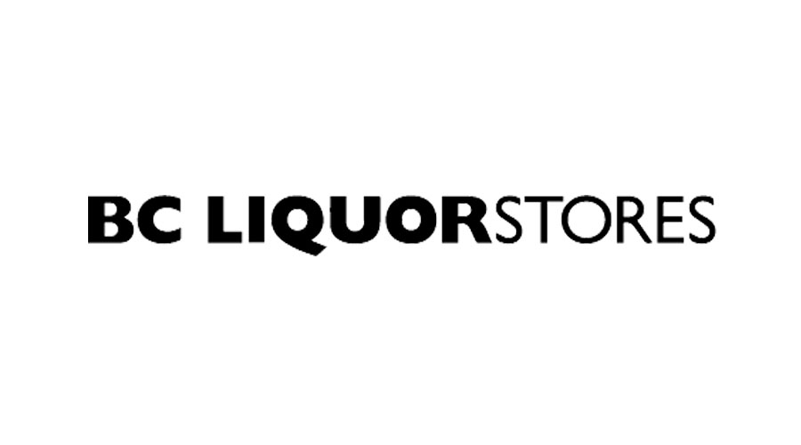

-   [Homework 8: Making a shiny app](#homework-8-making-a-shiny-app)
    -   [Available Features](#available-features)
    -   [Applied Features](#applied-features)
        -   [Feature 1](#feature-1)
        -   [Feature 2](#feature-2)
        -   [Feature 3](#feature-3)
        -   [Feature 4](#feature-4)
        -   [Feature 5](#feature-5)
        -   [Feature 6](#feature-6)
        -   [Feature 7](#feature-7)
        -   [Rest features](#rest-features)
    -   [Content](#content)
    -   [References](#references)

Homework 8: Making a shiny app
==============================

This is the repo for hw08-chenchenguo. The aim of hw-08 is to add
features to the BC liquor shiny app and deploy it.

Available Features
------------------

-   Add an option to sort the results table by price
-   Add an image of the BC Liquor Store to the UI
-   Use the DT package to turn the current results table into an
    interactive table
-   Add parameters to the plot
-   Place the plot and the table in separate tabs
-   Experiment with packages that add extra features to Shiny
-   Show the number of results found whenever the filters change.
-   Allow the user to download the results table
-   Show a new input that allows the user to filter by sweetness level
-   Allow user to search for multiple alcohol types simutaneously,
    instead of being able to choose only wines/beers
-   Provide a way for the user to show results from all countries
    (instead of forcing a filter by only one specific country)

Applied Features
----------------

### Feature 1

-   Add an option to sort the results table by price

### Feature 2

-   Add an image of the BC Liquor Store to the UI

-   

### Feature 3

-   Add another filter called alcohol\_content, user can choose their
    liquor based on alcohol content

### Feature 4

-   Place the plot and the table in separate tabs of mainbody, also in
    the separate filter of price, alcohol content and country

### Feature 5

-   Add an active button ‘plot’ to let user Firtstly choose the range
    and then plot the data (No plot before click ‘plot’ button)

### Feature 6

-   Add some CSS content, like a time context to let user know the
    current where you can click update to observe instant time

### Feature 7

-   Add dashboard feature to clearly show the structure and a link to BC
    LIQUOR store at right top
-   

### Rest features

-   About different colors and download link of csv file which also
    being added on app

Content
-------

| Content                   | Link                                                                                     |
|---------------------------|------------------------------------------------------------------------------------------|
| Readme file of Homework 8 | [Readme](https://github.com/STAT545-UBC-students/hw08-chenchenguo/blob/master/README.md) |
| Source code               | [app.R](https://github.com/STAT545-UBC-students/hw08-chenchenguo/blob/master/bcl/app.R)  |
| Rest files                | [files](https://github.com/STAT545-UBC-students/hw08-chenchenguo/tree/master/bcl)        |
| Result                    | [web](https://chenchenguo.shinyapps.io/BCL_LIQUOR/)                                      |

References
----------

-   [Dean Attali’s
    tutorial](http://deanattali.com/blog/building-shiny-apps-tutorial/)
-   [Rdocumentation](https://www.rdocumentation.org/)
-   [Icons](http://fontawesome.io/icons/)

Thank you.
